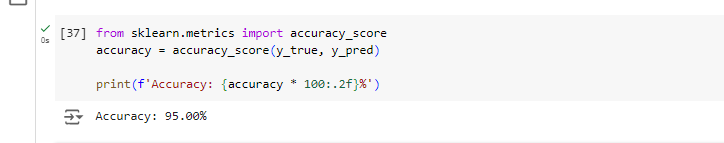
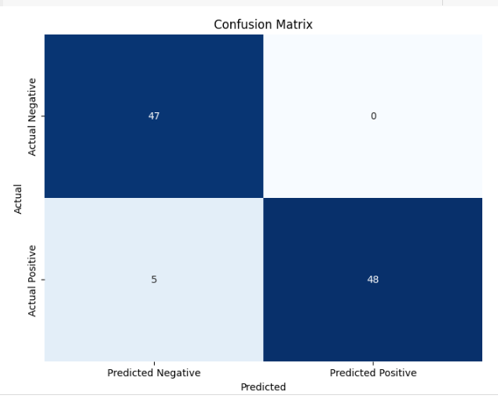

# Sentiment Analysis Using Gemini API

## Accuracy
The model achieved an accuracy of **95%** on the test set.

  <!-- Replace with actual image URL -->

## Confusion Matrix
Below is the confusion matrix for the test samples (n = 100):

  <!-- Replace with actual image URL -->
